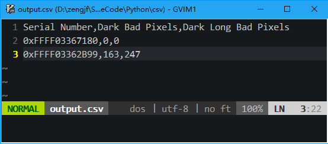

# CSV Data Switch

## 目录架构

```
    .
    ├── image
    │   └── output.png
    ├── input                      <--------- 将所有的csv文件让入这个文件夹
    │   ├── 1_FFFF03367180_MTCore_Log.csv
    │   └── 2_FFFF03362B99_MTCore_Log.csv
    ├── main.py                    <--------- 使用Python3运行该程序
    ├── output.csv                 <--------- main.py程序输出文件
    ├── config.ini                 <--------- 参考配置文件
    └── README.md
```


## 使用说明

* 编码语言采用[Python 3](https://www.python.org/)，请安装Python解释器：[Download Python 3](https://www.python.org/downloads/)
* 将所有的[csv](http://baike.baidu.com/item/CSV/10739)文件，放入[input](input)目录；  
* 修改[config.ini](config.ini)文件内容以满足对获取列的内容，配置文件标准请参考：[Configuration file parser](https://docs.python.org/3/library/configparser.html#supported-ini-file-structure)
  * 只需要写**section**部分，其他部分不需要，请参考当前的[config.ini](config.ini)进行修改；
  * **目前只支持对csv文件第一列值与config.ini的section中的值进行匹配；**
* 输出文件名：[output.csv](output.csv)；

## 输出信息


